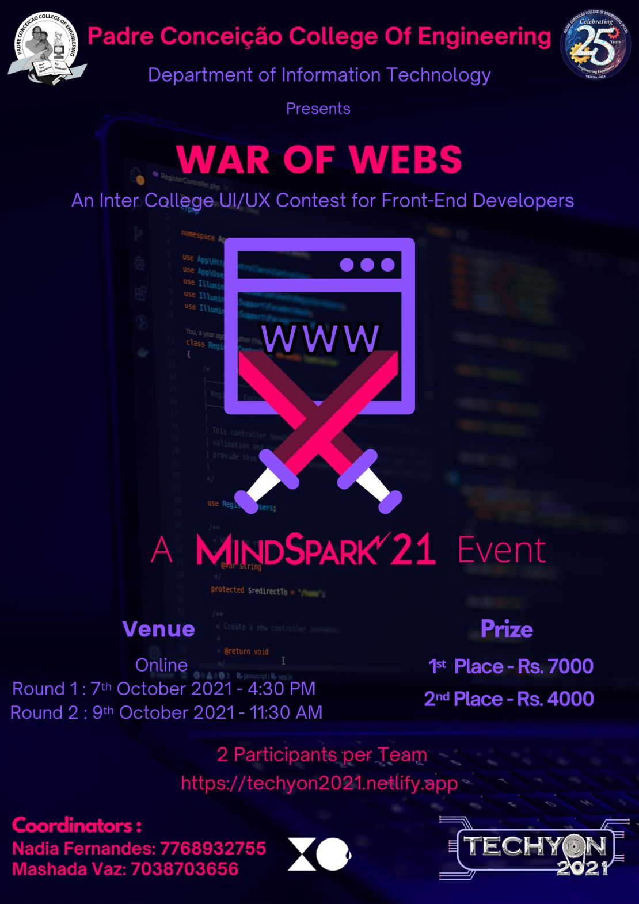
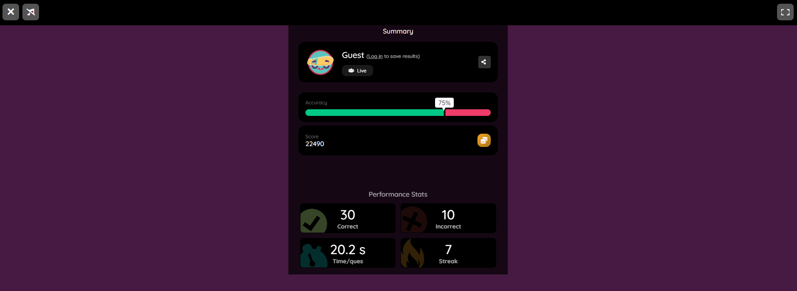

# Winners - First Place 🥇

## Description

- An Online Web Designing Contest. This event is the perfect platform for aspiring web designers to kickstart their front-end journey and tech wizards to flaunt their designing skills.

## Rules

- Two members per team
- Round 1 : This round will consist of multiple-choice questions on Basics of Web Development.
- Round 2: In this round, shortlisted participants from Round 1 will need to design a website (Mobile responsive). The topic will be given 24 hours prior to the time of submission.
- Permitted Tools: Application Software (Sublime, VS Code, etc.), Languages (HTML, LESS, SASS, jQuery, JS, etc.), Framework (Bootstrap, Tailwind, etc.)
- Judges decision will be final.
- Submissions beyond deadline will be considered invalid.

---

## Team #24 - Parvatibai Chowgule College

- [Gavin Pereira](https://github.com/pexeixv)
- [Saiprasad Naik](https://github.com/sai1001)

## Round #1

## Round #2

### Technologies used

- HTML
- SASS
- Javascript
- [Google Fonts](https://fonts.google.com/)
- [Font Awesome](https://fontawesome.com/)
- [Splide.js](https://splidejs.com/)
- [AOS](https://michalsnik.github.io/aos/)

### Time taken

### [Live Site](https://sandbox.gavinpereira.in)

### Preview

